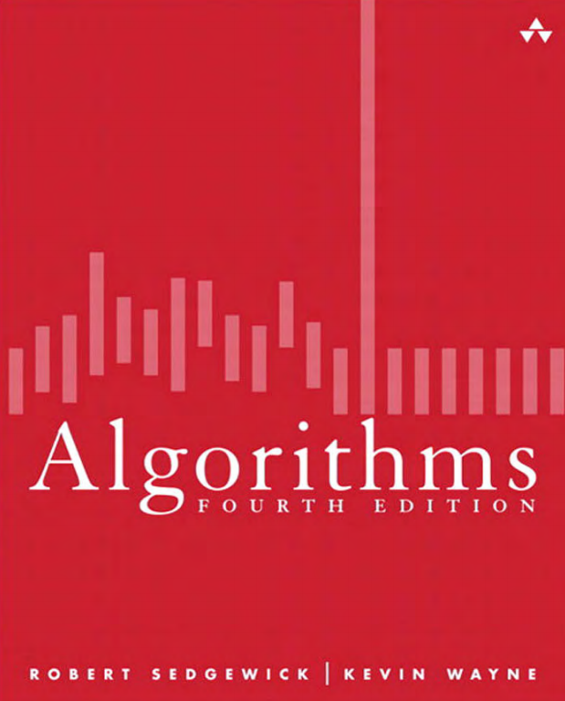

# Algorithm4-implemented by cpp

  

This is a personal note of reading *Algorithm 4th*.

All the code(specified by "Algorithm x.y) in this book are going to be implemented by c++.  

Some testfiles are from the official website, like largeUF.txt, 32Kints.txt.  

Chapter1 I try to avoid using STL cause they are basic data structure.   

Chapter2 - Chapter5 

For convenient change the size of array and random access, I use the vector STL to be the sorted array.  
Since our handmade data structure doesn't support generic template and range-for statement. In the later implementation I use (and only use) STL.  

For example, although we implement a basic structure 2.6 MinPQ, the std::priority_queue in <queue> is more convenient to use.   

Environment: linux-ubuntu  
Compiler: g++ 9  

## [Chapter 1 Fundamental](./chapter1)  

### 1.3 Bags, Queues, and Stacks  
+ [1.1 stack Array-edition](./chapter1/header/stack.h)  
+ [1.2 Stack linked-list edition](./chapter1/header/stack_LL.h)  
+ [1.3 Queue](./chapter1/header/queue.h)  
+ [1.4 Bag](./chapter1/header/bag.h)  

### 1.5 Case Study: Union-Find
+ [1.5 Union Find](./chapter1/header/UnionFind.h)  

## [Chapter 2 Sorting](./chapter2)  

### 2.1 Elementary Sorts  
+ [2.1 SelectionSort](./chapter2/header/selectionsort.h)  
+ [2.2 InsertionSort](./chapter2/header/insertionsort.h)  
+ [2.3 ShellSort](./chapter2/header/shellsort.h)  

### 2.2 Mergesort  
+ [2.4 MergeSort](./chapter2/header/mergesort.h)  

### 2.3 Quicksort  
+ [2.5 Quicksort](./chapter2/header/quicksort.h)   
  
### 2.4 Priority Queues  
**Heap**:  
+ [2.6 MaxPQ](./chapter2/header/maxPQ.h)  
+ [2.6 MinPQ](./chapter2/header/minPQ.h)  
+ [2.7 heapsort](./chapter2/header/heapsort.h)  

## [Chapter 3 Searching](./chapter3)  

### 3.1 Symbol Tables  
+ [3.1 Linked-List](./chapter3/header/linked_list.h)  
+ [3.2 BinarySearch](./chapter3/header/binarysearch.h)  

### 3.2 Binary Search Trees  

+ [3.3 BinarySearch Tree](./chapter3/header/BST.h)  

### 3.3 Balanced Search Trees  

+ [3.4 Balanced-BinarySearch Tree/Red-Black Tree](./chapter3/header/RB_tree.h)  

### 3.4 Hash Tables  

+ [3.5 SeparateChain](./chapter3/header/SeparateChain.h)  
+ [3.6 LinearProbing](./chapter3/header/LinearProbing.h)  

## [Chapter 4 Graph](./chapter4)  

### [4.1 Undirected Graph](./chapter4/header/graph.h)  

+ [4.1 Depth-First Search](./chapter4/header/dfs.h)  
+ [4.2 Breadth-First Search](./chapter4/header/bfs.h)  
+ [4.3 Connected Components](./chapter4/header/CC.h)  

### [4.2 Directed Graph](./chapter4/header/digraph.h)  

+ [4.4 Reachability](./chapter4/header/reachability.h)  
+ [4.5 Topological Sort](./chapter4/header/topological.h)  
+ [4.6 Kosaraju's Algorithm for Computing Strong Components](./chapter4/header/kosarajuSCC.h)  

### 4.3 Minimum Spanning Tree  

+ [Undirected Weighted Graph](./chapter4/header/EWG.h)  
+ [Lazy version of Prim's MST algorithm](./chapter4/header/lazyPrim.h)  
+ [4.7 Prim's MST Algorithm(eager version)](./chapter4/header/eagerPrim.h)  
+ [4.8 Kruskal's MST Algorithm](./chapter4/header/kruskal.h)  

### 4.4 Shortest Paths  

+ [directed Weighted Graph](./chapter4/header/EWDG.h)  
+ [4.9 Dijkstra's Shortest-Paths Algorithm](./chapter4/headerDjijkstra.h)   
+ [4.10 Shortest Paths in Edge-Weighted DAGS](./chapter4/header/acyclic.h)   
+ [4.11 Bellman-Ford Algorithm(queue-based)](./chapter4/header/bellman.h)  

## [Chapter 5 String](./chapter5)  

### 5.1 String Sorts  
+ [5.1 LSD string sort](./chapter5/header/LSD.h)   
+ [5.2 MSD string sort](./chapter5/header/MSD.h)  
+ [5.3 Three-Way string quicksort](.chapter5/header/quick3way.h)  
  
### 5.2 Tries  

+ [5.4 Trie Symbol Table](./chapter5/header/Tries.h)  
+ [5.5 Tenary Search Trie](./chapter5/header/TST.h)  

### 5.3 Substring Search  

+ [5.6 KMP](./chapter5/header/KMP.h)  
+ [5.7 BoyerMoore](./chapter5/header/BM.h)  
+ [5.8 Rabin-Karp](./chapter5/header/RabinKarp.h)  

### 5.4 Regular Expreesions  

+ [5.9 Regular-Expression](./chapter5/header/regular_expression.h)   

### 5.5 Data Compression  

+ [5.10 Huffman-Encoding Compression](./chapter5/header/huffman.h)  
+ 5.11 LZW Compression  

