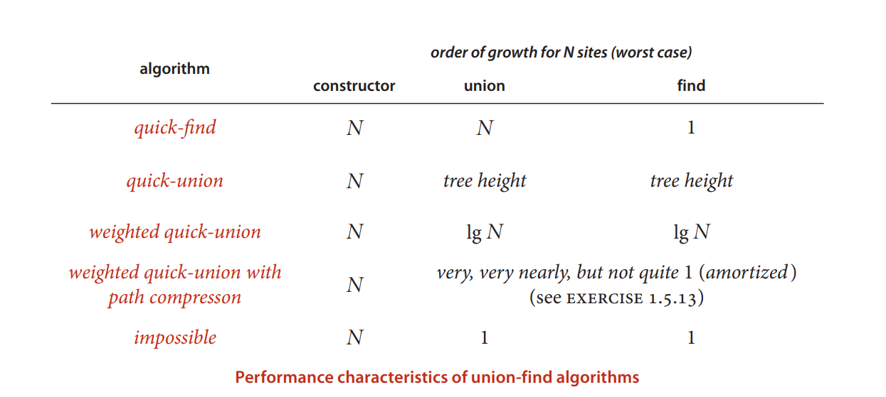

# Bag, Stack, Queue, UnionFind  

## [1.1 stack Array-edition](./header/stack.h)  

First In, Last Out (FILO)  

[1.2 linked-list edition](./header/stack_LL.h)  

## [1.3 Queue](./header/queue.h)  

First In, First Out  

## [1.4 bag](./header//bag.h)  

A Data Structure that can be only read, add, not modified or delete.  

## [1.5 Union Find](./header/UnionFind.h)  

To check Connectivity, quick-find->quick-union->weighted->union  

  

