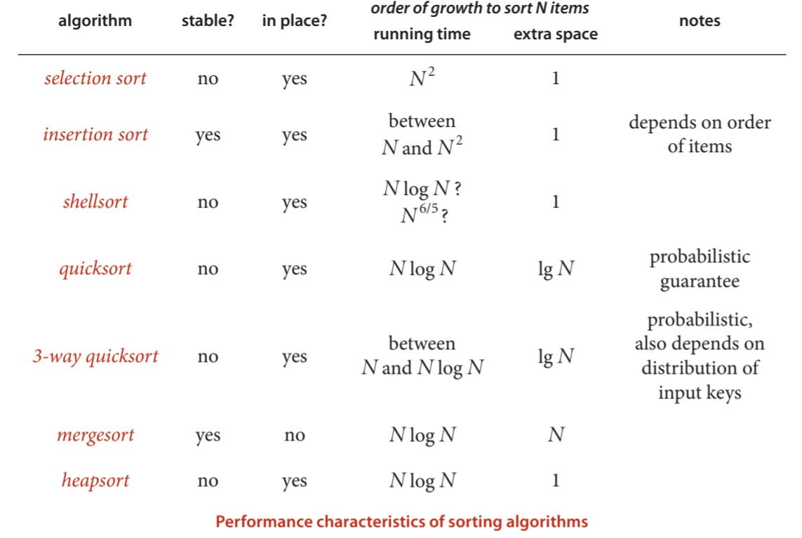

# Sort

`g++ sortTest.cpp`  
`./a.out`  

## For 32K random int: 

| Sort | Time | N times faster than SelectionSort |
| ---- | ---- | --------------------------------- |
| SelectionSort|  3.60278s  ||
| InsertionSort| 4.17365s | 0.86322 |
| ShellSort    | 0.020904s| 172.349|
|MergeSort(BottomUp)|  0.011873s | 303.443 |
|MergeSort(TopDown)| 0.012382s | 290.969 |
|Quicksort| 0.010922s | 329.864 |
|Quicksort(3way) | 0.017473s | 206.191 |
|heapsort| 0.017072s | 211.034  |  
  

  
  
## Some Important Conclusion  

### [SelectionSort](./header/selectionsort.h)

O(N), a simple example to introduce algorithm, nothing special.  
For sorting 1M int, you might take 2 whole days to accomplish it.  

### [InsertionSort](./header/insertionsort.h)

Average:    ~N^2/4 compares and ~N^2/4 exchanges  
worst case: ~N^2/4 compares and ~N^2/2 exchanges  
best case:   N-1   compares and 0      exchanges  

Owing to the times of its compare and exchange as O(n^2/4), InsertionSort is the best choice for small file. 

> Insertion Sort for 1K int: 7e-06s.  457 times faster than selection sort.  
> Insertion Sort for 8K int: 0.25124s.  0.790427 times faster than selection sort.  
> InsertionSort:  4.05283s  0.807027 times faster than SelectionSort.  

### [ShellSort](./header/shellsort.h)

> It's nothing but a optimized insertion sort.  

Shell is 600 times faster than Insertion.  

O(NlogN) on the average.  
unstable  
extra place O(1)  

### [MergeSort](./header/mergesort.h)  

Mergesort is a stable sorting algorithm.  

#### Top-down mergesort   
complexity: O(6NlogN)  
> 2N for copy  
> 2N for move back  
> at most 2N for compare  

Auxiliary space: O(N)  

#### Bottom-up mergesort  

benefit: non-recursive

1/2 NlgN - NlgN compares  
at most 6NlgN array accesses  

### [Quicksort](./header/quicksort.h)  

O(1.39NlgN) and unstable  
currently the fastest sorting algorithm  

### [heapsort](./header/heapsort.h)

O(NlgN)   
> 2NlgN + 2N compares  
> half that many changes  
  
It is rarely used in typical applications on modern systems because it has poor cache performance.   

   

