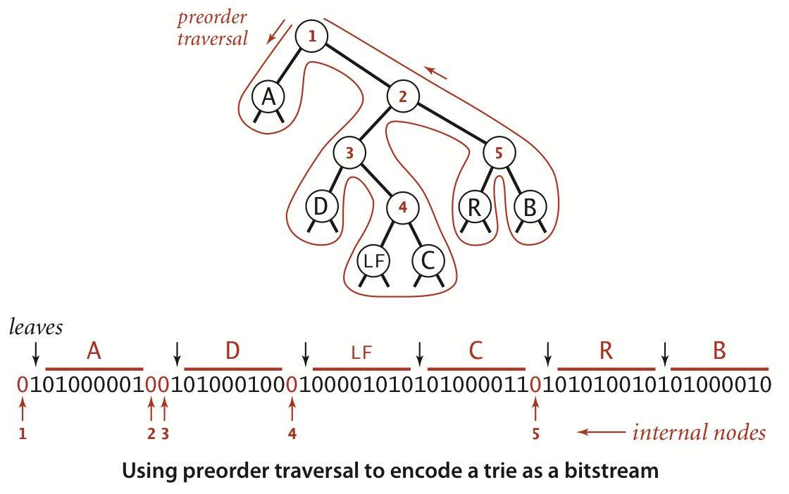

# String
## [5.1 LSD string sort](./header/LSD.h)    
Least-Significant-Digit.  
If the strings have the same length, this would be a good choice.  
It can guarantee its stability.  

`g++ LSD.cpp`  
`./a.out`  

```
Before LSD Sorting....
4PGC938
2IYE230
3CI0720
1ICK750
1OHV845
4JXY524
1ICK750
3CIO720
1OHV845
1OHV845
2RLA629
2RLA629
3ATW723

After LSD Sorting....
Sort time: 3e-05s. 

1ICK750
1ICK750
1OHV845
1OHV845
1OHV845
2IYE230
2RLA629
2RLA629
3ATW723
3CI0720
3CIO720
4JXY524
4PGC938
```
## [5.2 MSD string sort](./header/MSD.h)  

If the strings' length are not the same, this Most-Significant-Digit sorting method shall be a candidate.  
It's a variety of radix sorting, dispensing every elements in the whole bucket, then multiple small bucket, and so on.  In the end, the recursion terminates.  

`g++ MSD.cpp`  
`./a.out`  

```
Before MSD Sorting....
she
sells
seashells
by
the
sea
shore
the
shells
she
sells
are
surely
seashells

After MSD Sorting....
Sort time: 1.4e-05s. 

are
by
sea
seashells
seashells
sells
sells
she
she
shells
shore
surely
the
the
```
## [5.3 Three-Way string quicksort](./header/quick3way.h)  

As we did in chapter2, three-way quick sort is the most appropriate method for sorting generally same inputs. 

(many but unique val, e.g. tall, short, medium but appears 500 times respectively)  

It can be used to sort and analyze the prefix of website(domain), since most of them are more or less the same.  

`g++ quick3way.cpp`  
`./a.out`  

```
Before quick-3-string Sorting....
she
sells
seashells
by
the
sea
shore
the
shells
she
sells
are
surely
seashells

After quick-3-string Sorting....
Sort time: 1e-05s. 

are
by
sea
seashells
seashells
sells
sells
she
she
shells
shore
surely
the
the
```

## [5.4 Trie Symbol Table](./header/Tries.h)  

Trie is not universally implemented in built-in data structures in the STL of C++ or any other languages.  
Despite it can support search specified string, it also support search prefix of a string.  
However, if the characters are too excessive, it will build every node with a table, which will costs too many spaces.  

e.g. for ASCII we need 256 * N, for Unicode we might need 65536 * N.  

So for small set of character we can consider Trie. For example, search a string with just 0-9 or letters.  

`g++ Tries.cpp`  
`./a.out`  

We are reading the `tale.txt` in chapter3:  
```
..........

youand
youare
youd
youdoes
youll
young
younger
youngest
your
youre
yourn
yours
yourself
yourselfflung
yourselfthat
yourselves
youth
youthful
youthfulness
youths
youties
youunder
youve
zealous
```

## [5.5 Tenary Search Trie](./header/TST.h)  

To cope with the shorthand of Trie's space performce, we use the TST, it maintains three child node called left, mid, right.  

When a character is less than, equal to or greater than the node's character, it will be put in the left, mid, right respectively.   

`g++ TST.cpp`  
`./a.out`  

I didn't implement the keys() method for it, but the inside structure is consistent with what it is supposed to be.  

If you got interested, try it out!  


## [5.6 KMP](./header/KMP.h) 

Since char can be negative(between -128 - 127), to support the ASCII code beyond 127 might need more code to implement. Negative num cannot be the index to an array or a container. So to convenience our test and solely reinforce our understanding in KMP, I just implement a simple version that can only support lower and upper case of letters (it cannot even support spacehold!).  

If you want to construct a more robust version of KMP, you can modify the small fraction of codes to implement it.

It foresee the future and create a customed table to predict where the substring's going.  

`g++ KMP.cpp`  
`./a.out AACAA AABRAACADABRAACAADABRA`  

```
text:    AABRAACADABRAACAADABRA
pattern:             AACAA
```

`./a.out thing Withoutstrengthyoucannotprotectanything`  

```
text:    Withoutstrengthyoucannotprotectanything
pattern:                                   thing
```

## [5.7 BoyerMoore](./header/BM.h)

It creates a small table for step to jump at.  
My favorite substring matching algorithm.  

`g++ BM.cpp`  
`./a.out rol controls`  
```
text:    controls
pattern:     rol
```  

## [5.8 Rabin-Karp](./header/RabinKarp.h)
`g++ RK.cpp`  
`./a.out red thatlastshredofhumanitythatyoustillhad`
```
text:    thatlastshredofhumanitythatyoustillhad
pattern:           red                         
```

## [5.9 Regular-Expression](./header/regular_expression.h)  
Finite State Machine.  
It needs digraph and DFS for digraph in chapter4.  
`g++ grep.cpp`  
`./a.out "(A*B|AC)D"`  
```
ABD
ABCCBD
```

## [5.10 Huffman-Encoding Compression](./header/huffman.h)
Not implementing the binaryInput and expand(), writeTrie(), readTrie().  
`g++ huffman.cpp`  
`./a.out ABRACADABRA!` 

```
Compression begins... 
after compressing:
0101111011010100010111101100

Trie Tree:
! 1100
A 0
B 101
C 1101
D 100
R 111
```

`./a.out Acanopenercanopencans`  
```
Compression begins... 
after compressing:
001011011101101100010001100001111011101101100010001110111011010

Trie Tree:
A 0010
a 111
c 110
e 100
n 01
o 1011
p 000
r 0011
s 1010
```

## Update(Binary Trie)  

```
Compression begins... 
Trie:  PJ���
after compressing:
0101111011010100010111101100

Trie Tree:
! 1100
A 0
B 101
C 1101
D 100
R 111
```
  

In the Trie "PJ���" as you can see, 
P is corresponding to `01010000`, which is the first 8 bit of the trie, and second 8 bit `01001010` happens to correspond to J!  

What a coincidence! However, we cannot predict where the next byte is going.   

After all, our result isn't quite consistent with what the text book appears to be.  

My understanding is that STL priority_queue will sort the underlying vector<Node*>, which has a direct impact on the stability of the underlying data structure.  

For example, suppose A, B, C has the same frequency, and we insert A, B, C to the STL priority_queue. Now the default sorting method of STL doesn't guarantee that they're sorted stably, and this will results in achieving several different possible result:ABC, BAC, CAB, CBA, ACB, BCA, anyone of which would give you a different Huffman encoding for each element, and this finally makes our results different from the textbook.  

Even so, there's a lot of things which I cannot even achieve. From the result we can see I correctly implement writeTrie() and related method. But when I have this Trie string I cannot turn it back to a Huffman Tree. Maybe we cannot just translate the java code in textbook directly to C++. Fortunately, due to the fact that writeTrie() method is correctly implemented, the [BinaryIn class](./testfile/binaryIn.h) and [BinaryOut class](./testfile/binaryOut.) are correctly implemented for sure.  

Maybe you can go on to implement the readTrie() and expand(), which requires modifying some of the codes, and I need to admit this huffman algorithm is the trickiest and complicated code I've implemented so far, so just reading and understanding these codes requires a bit of energy and time, so good luck.  

## 5.11 LZW Compression  

Since I cannot guarantee the correctness of binaryIn, binaryOut and have not any experience of succeeding in expanding compressed file, I decide to put a stop here.  
